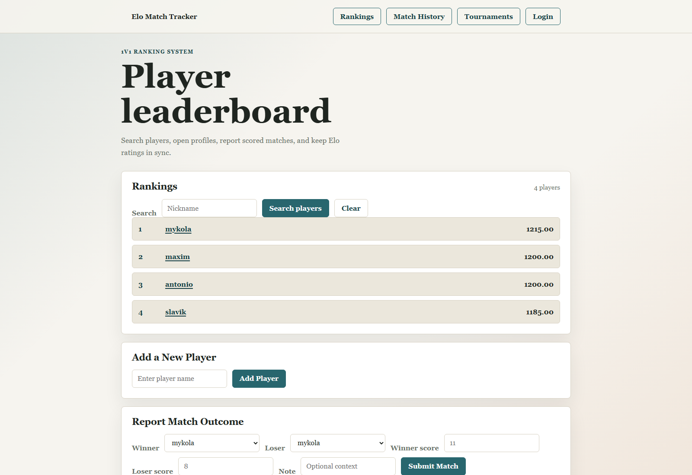
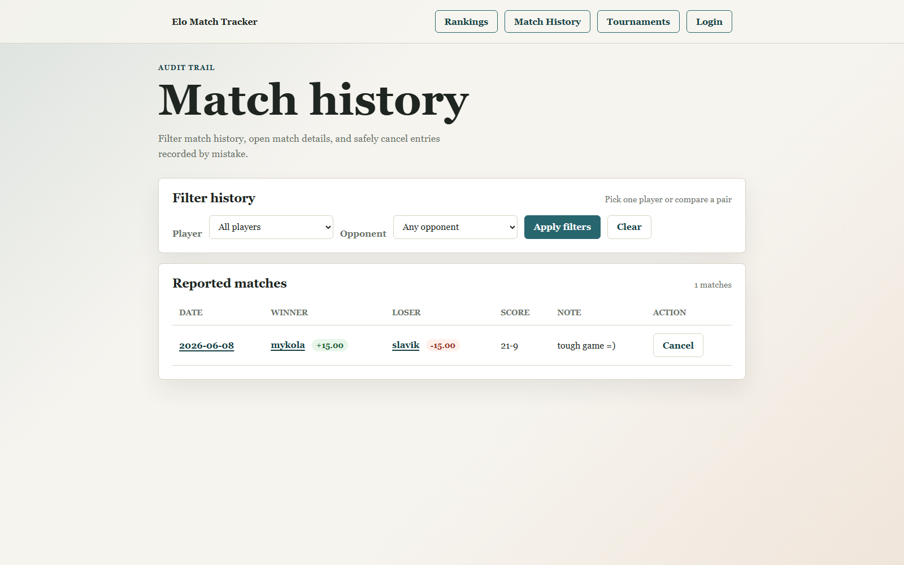
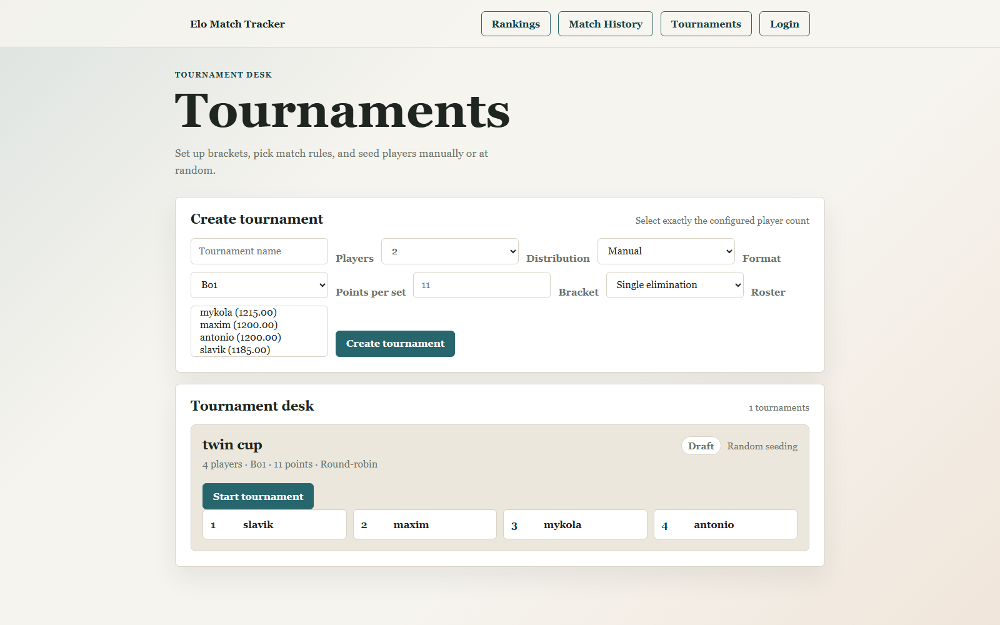
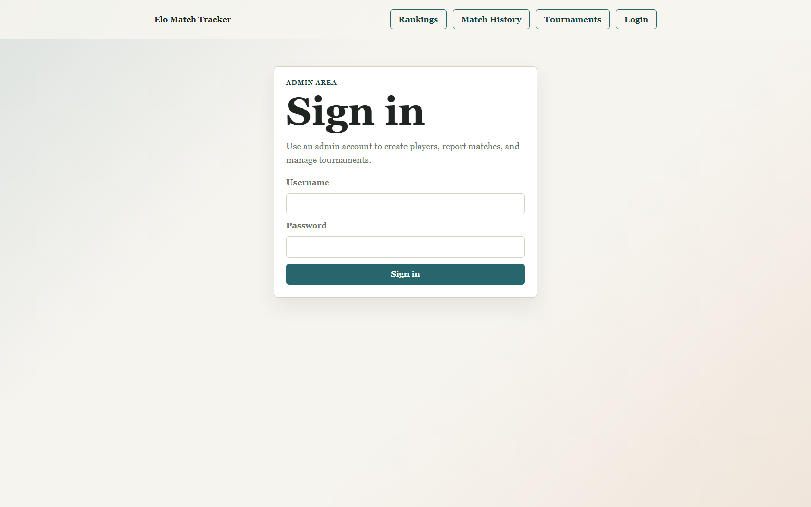
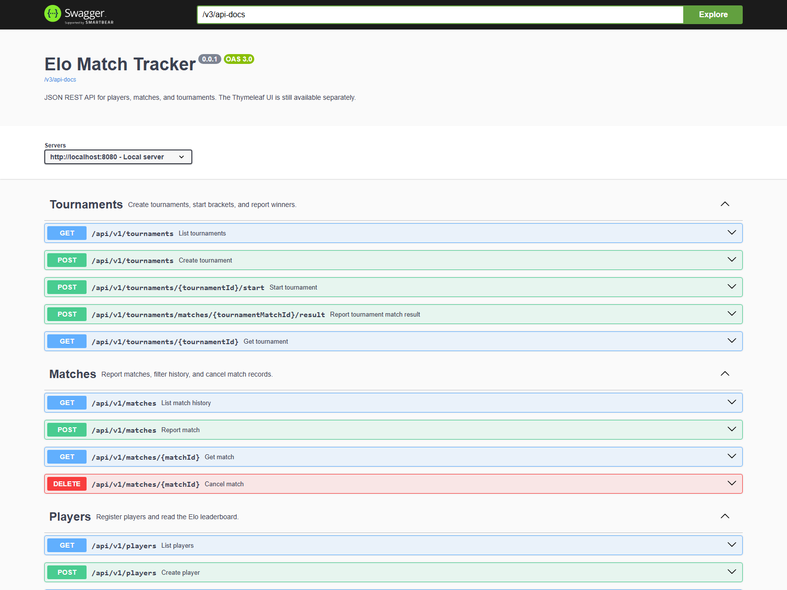
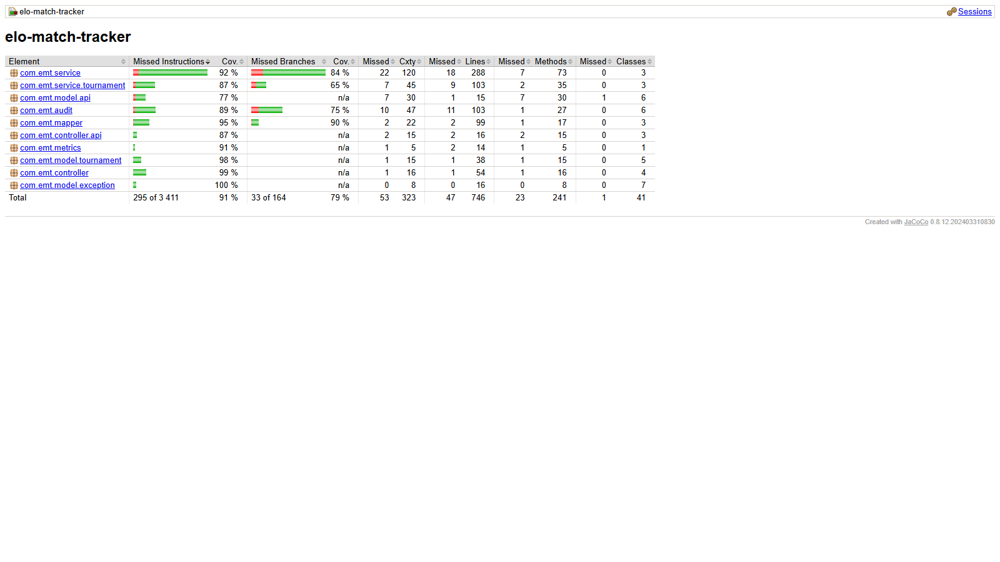
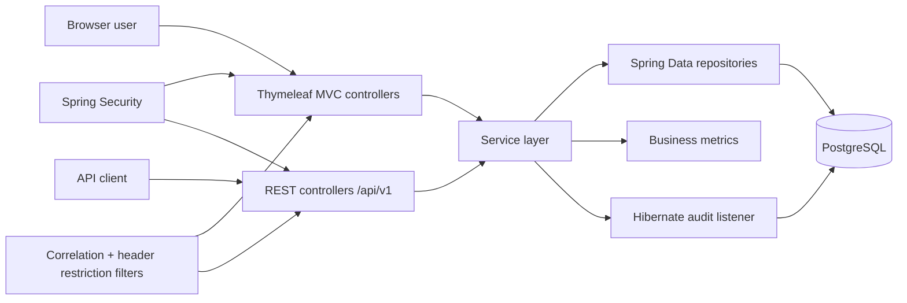

# Elo Match Tracker

Elo Match Tracker is a Spring Boot application for running a small 1v1 competitive ladder.
It supports player registration, scored match reporting, Elo rating updates, match history,
tournaments, audit history, a server-rendered UI, and a JSON REST API.

I built it as a portfolio-sized project, but with production-style engineering habits:
database migrations, layered architecture, security, observability, integration tests,
quality gates, and reproducible container builds.

## What Is Implemented

### Product requirements

- [x] Register players with an initial Elo rating of `1200`.
- [x] Search and paginate the leaderboard.
- [x] Open player profiles with win/loss stats and rating history.
- [x] Report matches with scores and optional notes.
- [x] Update both players' Elo ratings in one transaction.
- [x] Cancel matches and repair later Elo history.
- [x] Filter match history by one player or a head-to-head pair.
- [x] Create tournaments with manual or random seeding.
- [x] Support single-elimination and round-robin tournament flows.
- [x] Expose a JSON REST API under `/api/v1`.
- [x] Keep a Thymeleaf UI for human-friendly local use.

### Engineering requirements

- [x] PostgreSQL persistence with Flyway migrations.
- [x] Spring Security for admin-only write operations.
- [x] Audit revisions for player and match mutations.
- [x] Request correlation ids in logs and responses.
- [x] Configurable request blocking by restricted header-value pairs.
- [x] Actuator health, info, metrics, and business counters.
- [x] Unit and integration tests with Testcontainers.
- [x] JaCoCo coverage verification with a 70% minimum gate.
- [x] Checkstyle and PMD static analysis.
- [x] Jib container image build with a pinned base image digest.

## Screenshots

### Rankings



### Match history



### Tournament desk



### Admin login



### REST API contract

Swagger UI is generated from the REST controllers, so the public API contract stays close to
the code.



### Test coverage

Current JaCoCo report after `./gradlew check`:



## System Design



The main design choice is to keep business rules in services, not controllers.
The MVC UI and REST API share the same service layer, so match reporting, tournament progression,
audit behavior, and rating repair stay consistent across both interfaces.

More detail: [System Design](docs/SYSTEM_DESIGN.md) and [Architecture](docs/ARCHITECTURE.md).

## Important Flows

### Match reporting

1. The controller receives winner, loser, score, and note.
2. `MatchService` validates the request.
3. Both players are loaded with write locks.
4. Elo delta is calculated.
5. Player ratings and the match row are saved in one transaction.
6. Audit revisions and metrics are recorded around the same write path.

### Match cancellation

Elo is order-sensitive, so cancellation is not just a delete.
The service reverts the cancelled match delta, recalculates later affected matches,
updates stored deltas, and then removes the cancelled row.

### Tournament progression

Tournament setup validates the roster, stores seed order, and saves a draft tournament.
Starting a tournament generates bracket matches through strategy classes.
Reporting a tournament result also creates a normal Elo match, so tournament games still affect
the global leaderboard.

## Tech Stack

- Java 17
- Spring Boot 3
- Spring MVC, REST controllers, Thymeleaf
- Spring Security
- Spring Data JPA
- PostgreSQL and Flyway
- Micrometer and Actuator
- Gradle
- JUnit 5, Mockito, AssertJ, Testcontainers
- JaCoCo, Checkstyle, PMD
- Jib
- GitHub Actions

## Project Structure

```text
src/main/java/com/emt
|-- audit           # Hibernate audit listener and actor resolution
|-- configuration   # security, filters, errors, OpenAPI, time config
|-- controller      # MVC pages and REST API controllers
|-- entity          # JPA entities
|-- mapper          # entity/request/response mapping
|-- metrics         # business counters
|-- model           # requests, responses, enums, exceptions
|-- repository      # Spring Data repositories
`-- service         # transactions and business rules
```

## Documentation

- [System Design](docs/SYSTEM_DESIGN.md)
- [Architecture](docs/ARCHITECTURE.md)
- [Security](SECURITY.md)
- [Contributing](CONTRIBUTING.md)
- [Support](SUPPORT.md)

## Next Improvements

- Add export/import tools for player and match data.
- Add richer tournament analytics.
- Add a small admin dashboard for audit and operational metrics.
