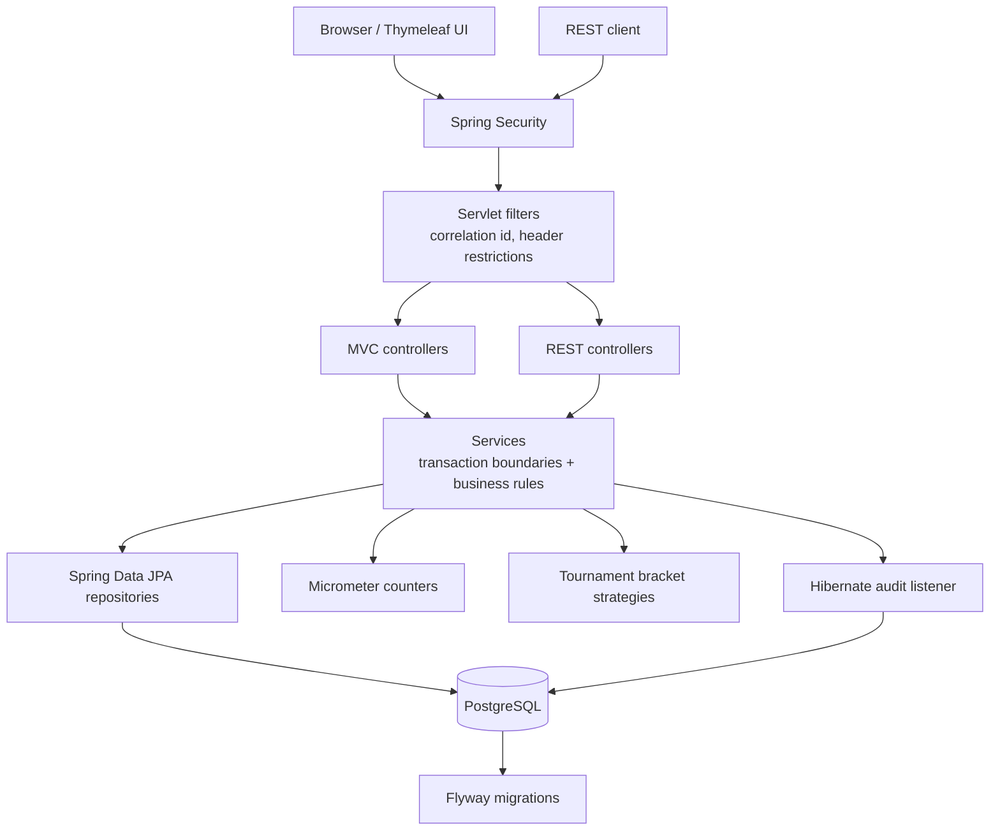
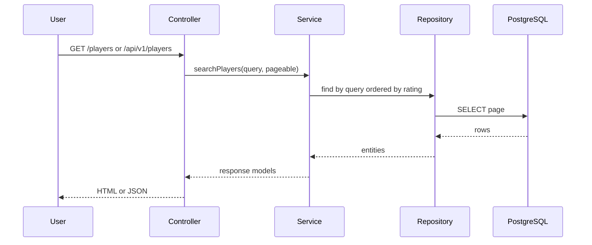
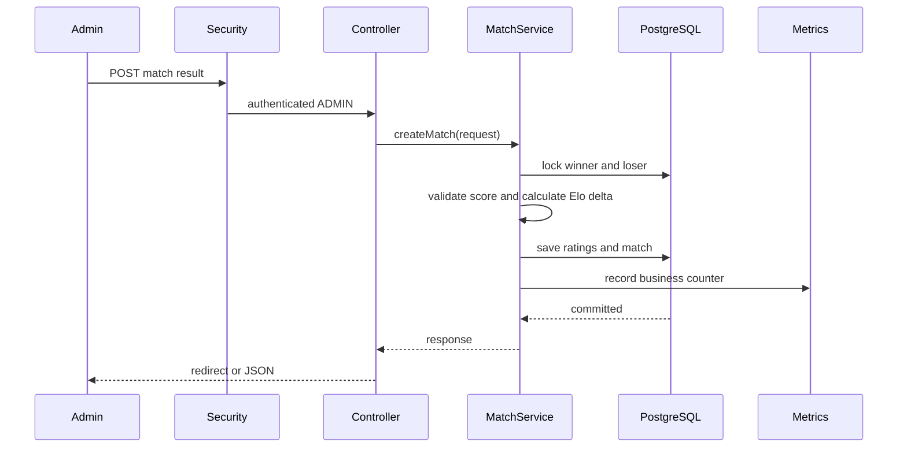

# System Design

This is a deliberately small system, so the design goal is not distributed complexity.
The goal is correctness, understandable boundaries, and enough operational discipline that the
project could grow without being rewritten.

## Scope

Elo Match Tracker manages a local competitive ladder:

- players join with a default Elo rating
- admins report matches and tournament results
- ratings update immediately
- history can be filtered and audited
- REST clients can use the same core behavior as the UI

Non-goals for the current version:

- multi-region deployment
- real-time matchmaking
- external identity provider integration
- asynchronous event processing

Those would be reasonable next steps, but they would add complexity before the current product needs it.

## High-Level Architecture



## Data Model

Core tables:

| Area | Tables | Notes |
| --- | --- | --- |
| Players | `player` | Stores nickname, Elo rating, registration time, and version. |
| Matches | `match` | Stores winner, loser, score, note, Elo delta, and creation time. |
| Tournaments | `tournament`, `tournament_participant`, `tournament_match` | Stores draft/active/completed tournament state and bracket matches. |
| Audit | `audit_revision` | Stores JSONB snapshots of player and match mutations. |

Important choices:

- Elo ratings use `NUMERIC(10, 2)` to avoid floating point drift.
- Match rows store the winner rating delta so cancellation can repair history.
- Tournament seed numbers are persisted, so random seeding becomes deterministic after save.
- Player rows are versioned, and rating updates also use write locks for safer concurrent updates.

## Read Path



The UI and REST API have different controllers, but both call the same service methods.
This avoids separate business rules for browser and API clients.

## Write Path



The transaction boundary lives in the service layer. That keeps rating updates atomic and makes it
harder for future controllers to bypass the correctness rules.

## Correctness: Match Cancellation

Elo depends on match order. If an old match is cancelled, only deleting that row would leave later
ratings wrong.

The cancellation algorithm:

1. Load the match being cancelled.
2. Revert its stored rating delta for the winner and loser.
3. Find later matches involving either affected player.
4. Recalculate those later matches in chronological order.
5. Update stored deltas and current player ratings.
6. Delete the cancelled match.

This is more expensive than a simple delete, but it preserves domain correctness.

## Tournament Design

Tournament logic uses strategy classes for bracket-specific behavior:

- `SingleEliminationBracketStrategy`
- `RoundRobinBracketStrategy`

`TournamentService` owns the lifecycle and validation. Strategy classes own bracket generation and
progression rules. This keeps the service from turning into one long conditional block as more formats
are added.

Current lifecycle:

```text
DRAFT -> ACTIVE -> COMPLETED
```

Reporting a tournament match also creates a normal Elo match, so tournament results affect the global
ladder instead of living in a separate scoring world.

## Security

Read-only pages and read-only API endpoints are public for easy browsing.
Write actions require `ADMIN`.

Security behavior:

- MVC writes use form login and CSRF protection.
- REST writes can use HTTP Basic and return API-style status codes.
- Swagger is available locally and disabled in production.
- Local default credentials are development-only and should be replaced through environment variables.

## Observability

The app exposes:

- `/actuator/health` for smoke checks
- `/actuator/info` for build and app info
- `/actuator/metrics` for JVM, HTTP, and business metrics
- `X-Correlation-Id` on responses for request tracing
- structured rejection logs for restricted header filtering

The correlation id filter accepts an incoming `X-Correlation-Id` when present, otherwise it generates one.

## Reliability And Failure Modes

| Risk | Current mitigation |
| --- | --- |
| Partial rating update | Service transaction saves both players and the match together. |
| Concurrent match reports for same player | Player rows are loaded with write locks. |
| Incorrect rating after cancellation | Later affected matches are recalculated. |
| Untraceable request failures | Correlation id is added to response and logging MDC. |
| Unsafe local defaults in production | `prod` profile requires real security credentials. |
| Known unwanted client traffic | Header restriction filter can reject configured header-value pairs. |

## Scaling Notes

The current app is designed for a single PostgreSQL-backed service instance or a small replicated service.
That is enough for the project scope.

If this became a larger product, the next scaling steps would be:

- move read-heavy leaderboard and match history queries behind cached projections
- add keyset pagination for long histories
- publish audit/business events to a message broker
- externalize identity management
- run multiple service instances behind a load balancer
- keep PostgreSQL as the transactional source of truth

## Validation

The normal quality gate is:

```bash
./gradlew check
```

It runs unit tests, integration tests, PMD, Checkstyle, and JaCoCo coverage verification.
Integration tests use Testcontainers PostgreSQL, so repository and transaction behavior is checked against
the same database family used locally.
